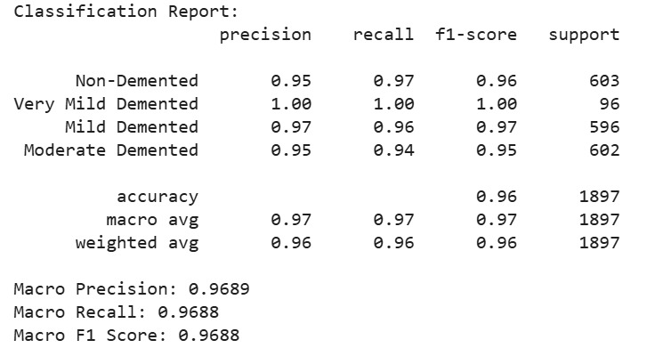

# Alzheimers_Detection
here is the video link

# 🧠 Alzheimer's Disease Detection using VGG16 + SVM

This project involves building a machine learning pipeline to detect Alzheimer's Disease from brain MRI images. It combines transfer learning using *VGG16* for feature extraction and a *Support Vector Machine (SVM)* for classification. The system is deployed as a web app using *FastAPI* and hosted on *Hugging Face Spaces*, with an Android APK provided for mobile use.

---

## 📑 Table of Contents

- [📌 Project Overview](#-project-overview)
- [🧠 Dataset](#-dataset)
- [🔧 Model Architecture](#-model-architecture)
- [📊 Performance](#-performance)
- [🌐 Web App Overview](#-web-app-overview)
- [🚀 Deployment on Hugging Face](#-deployment-on-hugging-face)
- [📱 APK for Android](#-apk-for-android)
- [🛠 Setup and Run Locally](#-setup-and-run-locally)
- [🖼 Sample Prediction Images](#-sample-prediction-images)

## 📌 Project Overview

The goal is to classify MRI brain scans into Alzheimer's-affected or normal categories using a hybrid deep learning + classical ML approach:
- Convert grayscale MRI scans to RGB.
- Use *VGG16* (pretrained on ImageNet) to extract deep features.
- Train a *Linear SVM* on these features for final classification.
- Build a *FastAPI* app for real-time predictions.
- Deploy the app on Hugging Face Spaces with support for web and Android APK access.

---

## 🧠 Dataset

- *Total images:* 9488 MRI scans.
- *Classes:* 4 categories (grouped for binary classification).
  - Non-Demented
  - Very Mild Demented
  - Mild Demented
  - Moderate Demented
- *Training samples:* 7591
- *Validation samples:* 1897

---

## 🔧 Model Architecture

### Feature Extractor: VGG16 (Transfer Learning)

- Base model: VGG16(weights='imagenet', include_top=False, pooling='avg')
- Input size: (176, 208, 3)
- Grayscale to RGB conversion
- Feature extraction via base_model.predict(preprocess_input(images))

### Classifier: Support Vector Machine (SVM)

- Kernel: Linear
- Accuracy:
  - ✅ *Validation Accuracy:* 95.98%
  - ✅ *Test Accuracy:* 96.05%

---

## 📊 Performance

| Metric          | Value     |
|-----------------|-----------|
| Validation Acc  | 95.98%    |
| Test Accuracy   | 96.05%    |
| Model Type      | VGG16 + SVM |
| Input Image Size| 176 x 208 |
### Classification Report

### Confusion Matrix

---

## 🌐 Web App Overview

- Built with *FastAPI*.
- Upload MRI scan images (JPG/PNG).
- Real-time prediction of Alzheimer's status.
- Clean, simple web interface.

### Routes:
- GET / – Home page
- POST /predict – Image upload + Prediction

---

## 🚀 Deployment on Hugging Face

App is live and hosted using [Hugging Face Spaces](https://huggingface.co/spaces) using Docker backend.

✅ *Try the app online*: [App Link Here]

---

## 📱 APK for Android

The app was converted to an APK for Android use via web2apk or PWA wrapping.

📲 *Download APK*: [APK Link Here]

---

## 🛠 Setup and Run Locally

### 1. Clone this Repository
```bash
git clone https://github.com/your-username/alzheimers-detection.git
cd alzheimers-detection
