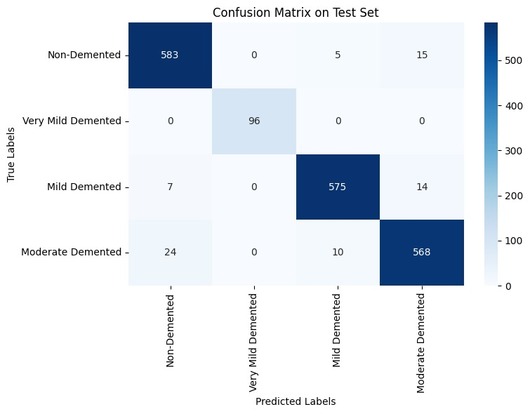
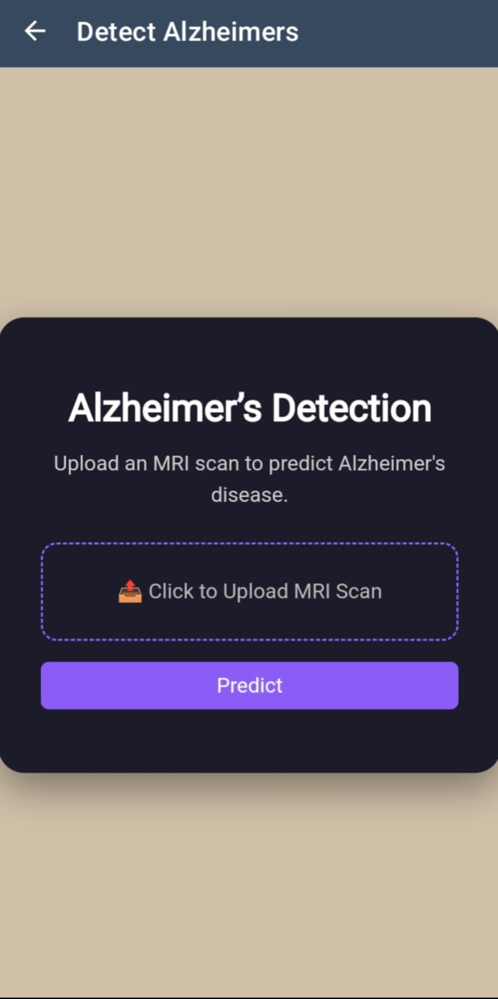

# Alzheimers_Detection
  
# 🧠 Hybrid framework for alzheimer’s disease classification

This project involves a comparative analysis of a hybrid framework for Alzheimer’s Disease classification using brain MRI images. It extracts deep features from five pre-trained models—VGG16, DenseNet169, ResNet50, MobileNetV2, and Vision Transformer (ViT)—which are then concatenated and passed to a multi-class Support Vector Machine (SVM) classifier for final prediction. The system is deployed as a web app using *FastAPI* and hosted on *Hugging Face Spaces*, with an Android APK provided for mobile use.

---

## 📑 Table of Contents

- [📌 Project Overview](#-project-overview)
- [🧠 Dataset](#-dataset)
- [🔧 Model Architecture](#-model-architecture)
- [📊 Performance](#-performance)
- [🌐 Web App Overview](#-web-app-overview)
- [🚀 Deployment on Hugging Face](#-deployment-on-hugging-face)
- [📱 APK for Android](#-apk-for-android)
- [🛠 Setup and Run Locally](#-setup-and-run-locally)
- [🖼 Sample Prediction Images](#-sample-prediction-images)

## 📌 Project Overview

The goal is to classify MRI brain scans into four categories using a hybrid deep learning + classical ML approach:
- Convert grayscale MRI scans to RGB.
- Use *VGG16/ DenseNet169/ ResNet50/ MobileNetV2/ Vision Transformer* to extract deep features.
- Train a *Linear SVM* on these features for final classification.
- Build a *FastAPI* app for real-time predictions.
- Deploy the app on Hugging Face Spaces with support for web and Android APK access.

---

## 🧠 Dataset

- *Total images:* 9488 MRI scans.
- *Classes:* 4 categories (grouped for binary classification).
  - Non-Demented
  - Very Mild Demented
  - Mild Demented
  - Moderate Demented
- *Training samples:* 7591
- *Validation samples:* 1897

---

## 🔧 Model Architecture

### Feature Extractor: (Transfer Learning)

*VGG16
- Base model: VGG16(weights='imagenet', include_top=False, pooling='avg')
- Input size: (176, 208, 3)
- Grayscale to RGB conversion
- Feature extraction via base_model.predict(preprocess_input(images))

*ResNet-50
- Base model: 
- Input size: 
- Grayscale to RGB conversion
- Feature extraction via base_model.predict(preprocess_input(images))

*MobileNetV2
- Base model:
- Input size: 
- Grayscale to RGB conversion
- Feature extraction via base_model.predict(preprocess_input(images))

*DenseNet-169 
- Base model:
- Input size: 
- Grayscale to RGB conversion
- Feature extraction via base_model.predict(preprocess_input(images))

*Vision Tranformer(ViT)
- Base model:
- Input size: 
- Grayscale to RGB conversion
- Feature extraction via base_model.predict(preprocess_input(images))

### Classifier: Support Vector Machine (SVM)

- Kernel: Linear
- The regularization parameter was set to C = 1.0.
  
---

## 📊 Performance

Byb comparing the results the analysis suggests that ResNet50 + SVM and DenseNet169 + SVM are optimal choices for high-accuracy medical diagnostics, while MobileNetV2 + SVM serves well in scenarios demanding a lighter model footprint.

Results for best model
| Metric          | Value     |
|-----------------|-----------|
| Validation Acc  | 99.28%    |
| Test Accuracy   | 99.53%    |
| Model Type      | ResNet-50 + SVM |

### Classification Report

### Confusion Matrix

---

## 🌐 Web App Overview

- Built with *FastAPI*.
- Upload MRI scan images (JPG/PNG).
- Real-time prediction of Alzheimer's status.
- Clean, simple web interface.
  

### Routes:
- GET / – Home page
- POST /predict – Image upload + Prediction

---

## 🚀 Deployment on Hugging Face

App is live and hosted using [Hugging Face Spaces](https://huggingface.co/spaces) using Docker backend.

✅ *Try the app online*: [https://huggingface.co/spaces/VaishnaviTammana20/ad_detection]

---

## 📱 APK for Android

The app was converted to an APK for Android use via web2apk or PWA wrapping.

📲 *Download APK*: [https://old.my.mobiroller.com/downloadAPK/?apk=3466797039216.apk]

---

## 🛠 Setup and Run Locally

### 1. Clone this Repository

git clone https://github.com/vaishnavi1728/Alzheimers_Detection.git
cd alzheimers-detection

### 2. Install Dependencies
pip install -r requirements.txt

### 3. Run FastAPI App
```bash
uvicorn app:app --reload

